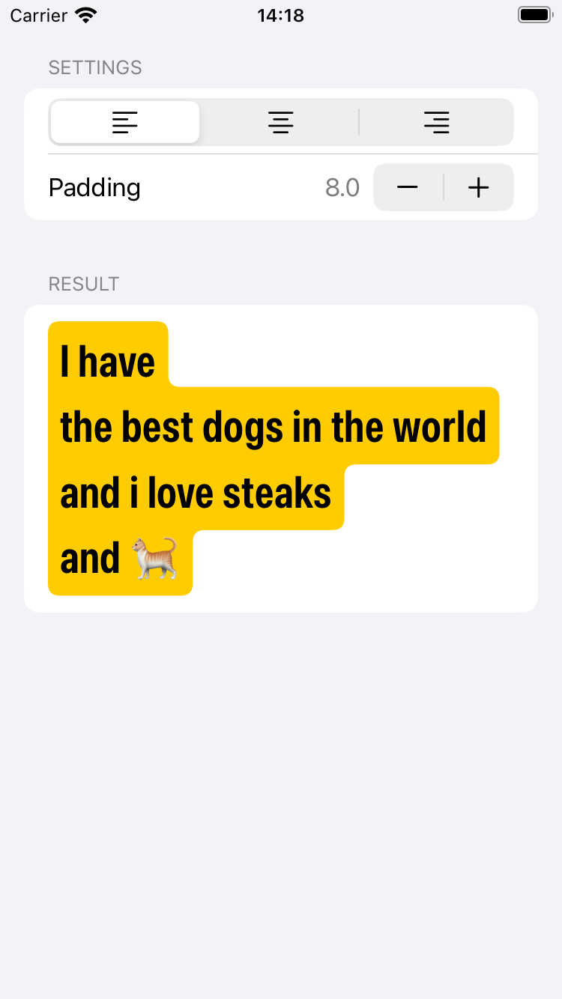
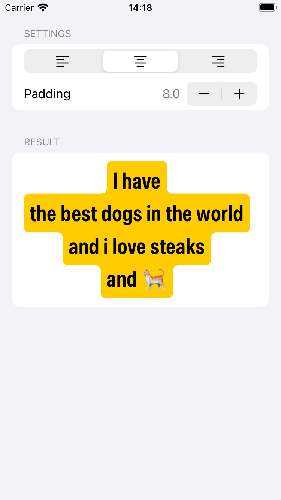
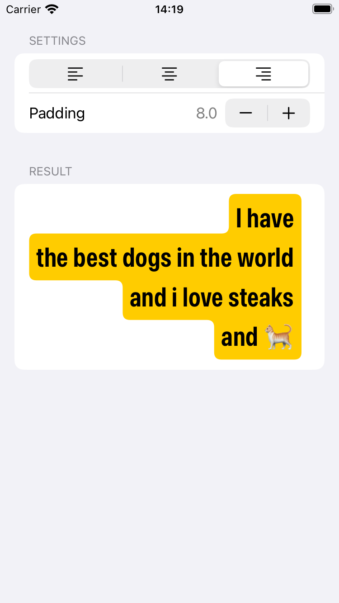

# RoundedBackgroundLabel

  

## Disclaimer
This is not production ready code (at least i haven't tried it)

## Contents
This project contains an example of how you can implement a label where background follows the shape of the text similar to Instagram stories.

## TODO

- Support background for provided range(s) (e.g highlight all links in the text)
- Support background for text input (UITextView subclass)
